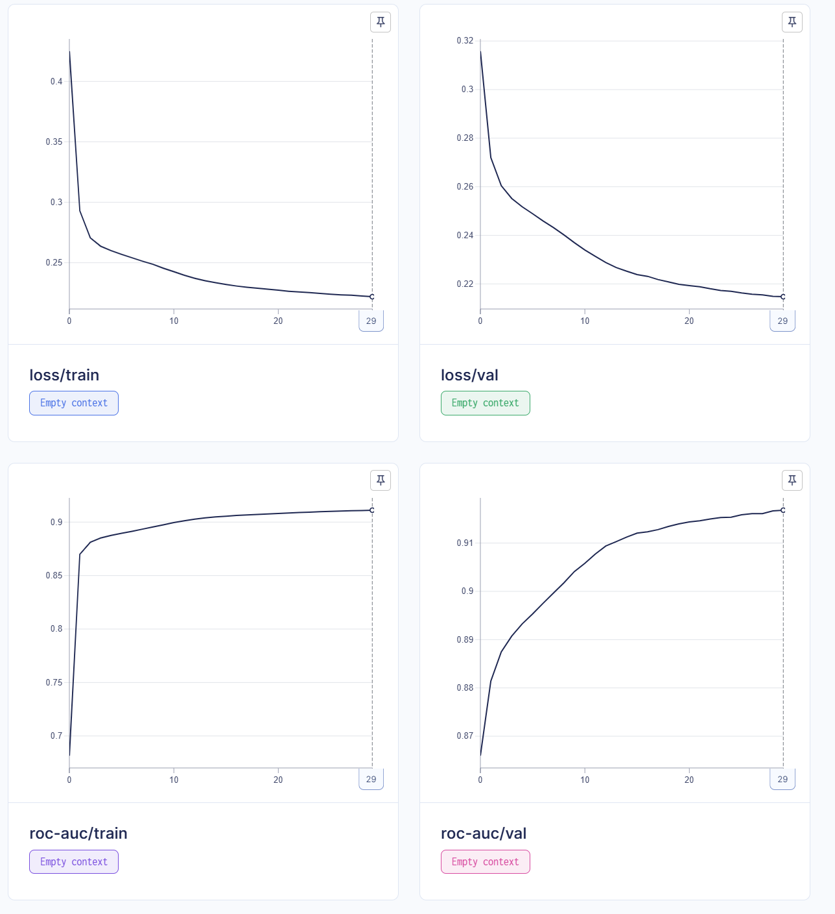

В результате домашнего задания было обучено 17 моделей для выявления лучшей архитектуры.

Эксперимент №1

При обучении самой простой модели можно было рассмотреть какое оптимельное количество эпох потребуется для обучения более сложных.

В результате эксперимента было выяснено, что после 15-ой эпохи основная метрика уже слабо уменьшается, поэтому для дальнейших моделей было выбрано такое количество эпох

Эксперимент №2

При усложнении архитектуры модели получилось достичь немного лучшего результата метрики на валидации, а так же более быстрой сходимости

Эксперимент №3

Добавление новых архитектурных решений ещё больше увеличило метрику валидации и модель начала быстрее сходиться.

Добавление skip connections помогло бороться с затухающими градиентами, а Batch Norm задать похожесть распределений между стоями.

Эксперимент №4

В зависимости от р модель может показывать как улучшение, так и ухудшение.
Самый лучший результат получился при р = 0.01, худший при р = 0.9.

Dropout может принести как пользу, так и вред, важно правильно подбирать параметры.

Эксперимент №5

Получив оптимальную модель можно перейти к подбору остальных параметров, которые так же могут увеличить качество модели.

Худшее влияние на модель оказал параметр Weight Decay, который добавлял сильную рещуляризацию и не давал модели обучаться.

Лучшими же параметрами оказались wd = 0.001 и lr = 0.05.

