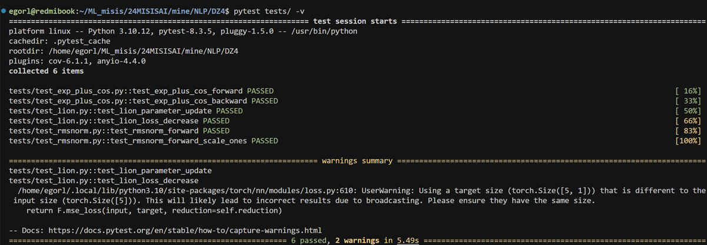

# Воспроизведение результатов

```bash
pytest tests/ -v
```

## Для каждой реализации были написаны по 2-3 теста, который проверяли близость кастомной и встроенной функций. Для проверки LION использовал модель из первого домашнего задания.


# Результат

